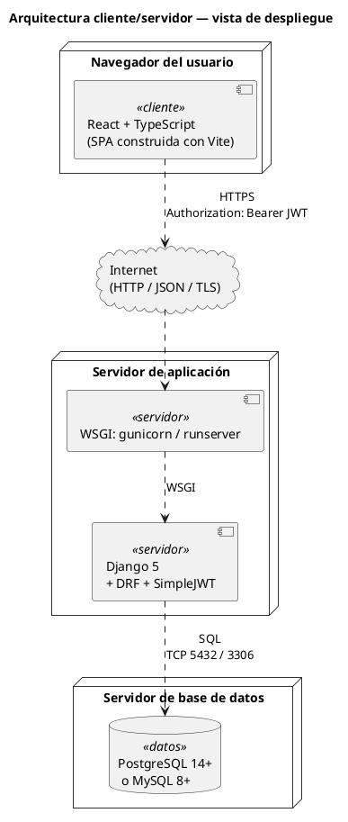
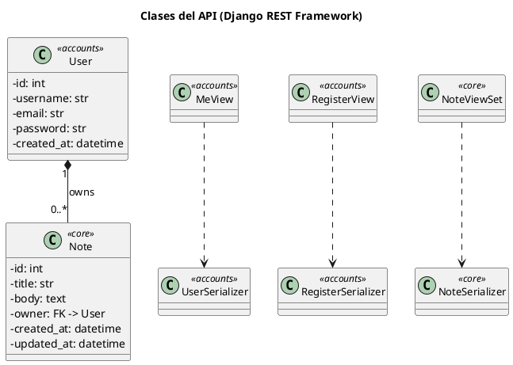
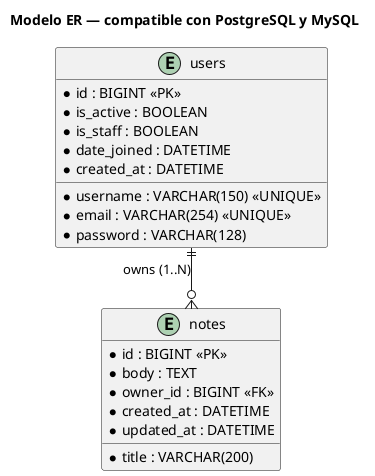
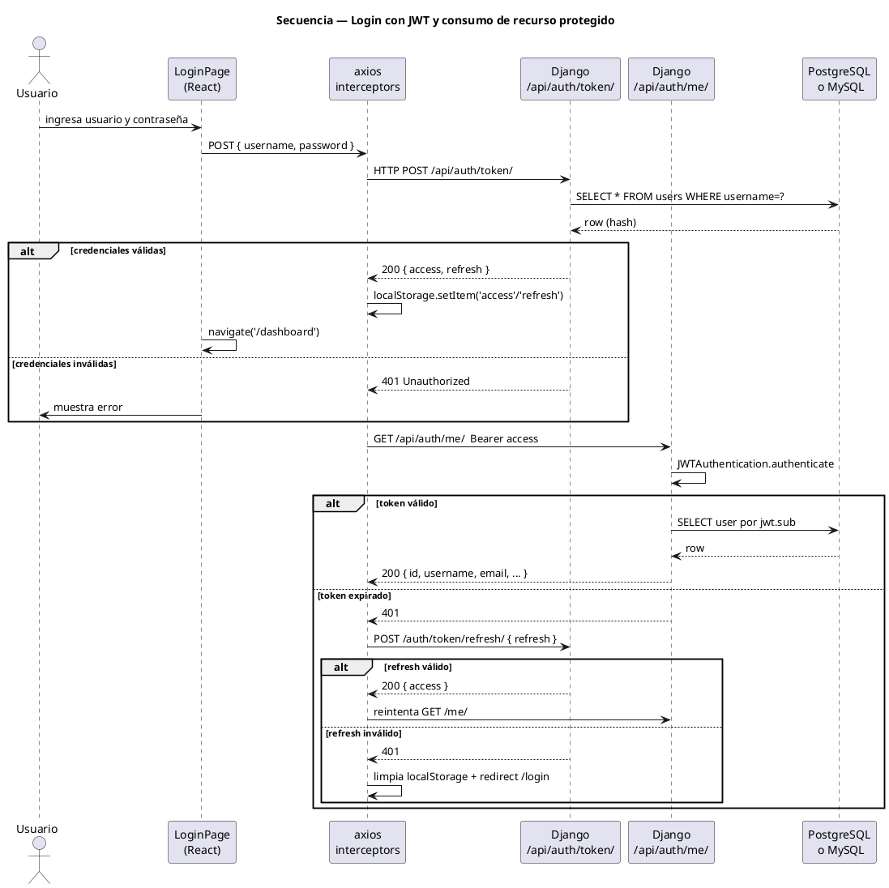

# Guía de Laboratorio 03 — Frontend React + UML + Verificación

> **Parte 3 de 3** · ⏱ Duración estimada: **1.5 – 2 horas**
> **Asignatura:** Programación Orientada a Objetos (4to curso)
> **Prerrequisito:** haber completado la [Parte 2 — Backend Django](./guia-laboratorio-02.md) y tener el API REST funcionando con JWT.
> **Alcance de esta parte:** crear el cliente con Vite + React + TypeScript, implementar la autenticación contra el API, construir el dashboard que consume notas, generar los diagramas UML de la arquitectura y verificar la integración completa.

| ⬅️ Anterior | 📘 Esta guía | 🏁 Cierre |
|---|---|---|
| [02 — Backend Django](./guia-laboratorio-02.md) | **03** Frontend React | *Parte final de la práctica* |

---

## Tabla de contenido

12. [Fase 7 — Frontend: Vite + React + TypeScript](#12-fase-7--frontend-vite--react--typescript)
13. [Fase 8 — Frontend: autenticación y rutas protegidas](#13-fase-8--frontend-autenticación-y-rutas-protegidas)
14. [Fase 9 — Frontend: consumir la API desde el dashboard](#14-fase-9--frontend-consumir-la-api-desde-el-dashboard)
15. [Fase 10 — UML de referencia (PlantUML)](#15-fase-10--uml-de-referencia-plantuml)
16. [Verificación final y checklist](#16-verificación-final-y-checklist)
17. [Ejercicios de extensión](#17-ejercicios-de-extensión)
18. [Recursos adicionales](#18-recursos-adicionales)

> **Nota:** la numeración 12–18 es la continuación de las secciones 1–10 de las Partes 1 y 2 (se preserva para mantener referencias cruzadas estables). La sección 11 fue absorbida como punto de control de la Fase 5 (CORS) en la Parte 2.

> **Punto de control al final de esta guía:** el sistema completo funciona end-to-end. Frontend autenticado, CRUD de notas, base de datos poblada, UML renderizado.

---

## 12. Fase 7 — Frontend: Vite + React + TypeScript

> **Concepto POO:** un proyecto frontend es un **módulo de alto nivel** que depende de una *interfaz* (el API). El cliente no debe conocer la implementación interna del servidor — sólo el contrato JSON.

### Antes de empezar

Asegúrese de estar en la **raíz del proyecto** y de que el backend ya está corriendo (la Parte 2 debe estar finalizada):

```powershell
# Vaya a la raíz absoluta del proyecto (ajústela si su ruta es distinta)
$root = "D:\UNEMI\2026\PERIODO-ABRIL-JUNIO\POO\POO-4TO-CURSO-DJANGO-POSTGRES-REACT"
Set-Location $root

# Si viene de la Parte 2, también puede simplemente subir un nivel:
# Set-Location ..\..
```

> **Tip Node:** al entrar a `frontend/`, ejecute `nvm use` (lee `.nvmrc` y cambia a Node 20). Si instaló Node con `winget` (sin `nvm-windows`), omita este paso y use la versión global.

### 12.0 Crear las carpetas del código fuente

Vite crea `src/` con archivos de muestra, pero las carpetas `api/`, `auth/`, `types/`, `components/` y `pages/` que usaremos **no existen por defecto**. Ejecute el siguiente bloque **una sola vez** desde `frontend/` (se usará en las Fases 7, 8 y 9):

```powershell
Set-Location frontend
New-Item -ItemType Directory -Path src\api, src\auth, src\types, src\components, src\pages -Force
```

### 12.1 Crear el proyecto con Vite

```powershell
npm create vite@latest . -- --template react-ts
```

> Si Vite pregunta `Current directory is not empty. Please choose how to proceed:`, elija **`Ignore files and continue`** — el directorio solo contiene `.nvmrc` (que no toca).

### 12.2 Instalar dependencias

```powershell
npm install
npm install axios react-router-dom@^6
```

> **¿Por qué pinar `react-router-dom@^6`?** La versión 7 cambió la API. Este laboratorio usa la API de v6 (`createBrowserRouter` + `RouterProvider`); sin el pin, `npm install` instalaría v7 por defecto (junio 2026: 7.16) y varias importaciones requerirían migración.

### 12.3 Configurar variables de entorno

📄 **`frontend/.env.example`**

```ini
VITE_API_BASE_URL=http://localhost:8000/api/v1
```

Copie a `.env`:

```powershell
Copy-Item .env.example .env
```

### 12.4 Proxy de desarrollo (alternativa a la variable de entorno)

> **Reemplace todo el contenido** del archivo `vite.config.ts` (Vite genera una configuración por defecto que debe ser sustituida).

📄 **`frontend/vite.config.ts`**

```typescript
import { defineConfig } from "vite";
import react from "@vitejs/plugin-react";

export default defineConfig({
  plugins: [react()],
  server: {
    port: 5173,
    proxy: {
      "/api": {
        target: "http://localhost:8000",
        changeOrigin: true,
      },
    },
  },
});
```

### 12.5 Tipos compartidos

📄 **`frontend/src/types/api.ts`**

```typescript
export interface User {
  id: number;
  username: string;
  email: string;
  first_name?: string;
  last_name?: string;
  created_at?: string;
}

export interface Note {
  id: number;
  title: string;
  body: string;
  owner: string;
  created_at: string;
  updated_at: string;
}

export interface AuthTokens {
  access: string;
  refresh: string;
}

export interface PaginatedResponse<T> {
  count: number;
  next: string | null;
  previous: string | null;
  results: T[];
}
```

### 12.6 Cliente HTTP con interceptors

📄 **`frontend/src/api/client.ts`**

```typescript
import axios, { AxiosError, InternalAxiosRequestConfig } from "axios";

const baseURL = import.meta.env.VITE_API_BASE_URL ?? "/api/v1";

export const apiClient = axios.create({ baseURL });

const ACCESS_KEY = "access_token";
const REFRESH_KEY = "refresh_token";

export const tokenStore = {
  getAccess: () => localStorage.getItem(ACCESS_KEY),
  getRefresh: () => localStorage.getItem(REFRESH_KEY),
  setTokens: (access: string, refresh: string) => {
    localStorage.setItem(ACCESS_KEY, access);
    localStorage.setItem(REFRESH_KEY, refresh);
  },
  clear: () => {
    localStorage.removeItem(ACCESS_KEY);
    localStorage.removeItem(REFRESH_KEY);
  },
};

apiClient.interceptors.request.use((config: InternalAxiosRequestConfig) => {
  const access = tokenStore.getAccess();
  if (access && config.headers) {
    config.headers.Authorization = `Bearer ${access}`;
  }
  return config;
});

apiClient.interceptors.response.use(
  (response) => response,
  async (error: AxiosError) => {
    const originalRequest = error.config as InternalAxiosRequestConfig & {
      _retry?: boolean;
    };

    if (
      error.response?.status === 401 &&
      !originalRequest._retry &&
      tokenStore.getRefresh()
    ) {
      originalRequest._retry = true;
      try {
        const { data } = await axios.post<{ access: string }>(
          `${baseURL}/auth/token/refresh/`,
          { refresh: tokenStore.getRefresh() }
        );
        localStorage.setItem(ACCESS_KEY, data.access);
        if (originalRequest.headers) {
          originalRequest.headers.Authorization = `Bearer ${data.access}`;
        }
        return apiClient(originalRequest);
      } catch {
        tokenStore.clear();
        window.location.href = "/login";
      }
    }
    return Promise.reject(error);
  }
);
```

### 12.7 Endpoints de auth y notas

📄 **`frontend/src/api/auth.ts`**

```typescript
import { AuthTokens, User } from "../types/api";
import { apiClient, tokenStore } from "./client";

export async function login(username: string, password: string): Promise<AuthTokens> {
  const { data } = await apiClient.post<AuthTokens>("/auth/token/", { username, password });
  tokenStore.setTokens(data.access, data.refresh);
  return data;
}

export async function register(payload: {
  username: string;
  email: string;
  password: string;
  password_confirm: string;
}): Promise<User> {
  const { data } = await apiClient.post<User>("/auth/register/", payload);
  return data;
}

export async function fetchMe(): Promise<User> {
  const { data } = await apiClient.get<User>("/auth/me/");
  return data;
}

export function logout(): void {
  tokenStore.clear();
}
```

📄 **`frontend/src/api/notes.ts`**

```typescript
import { Note, PaginatedResponse } from "../types/api";
import { apiClient } from "./client";

export async function listNotes(): Promise<Note[]> {
  const { data } = await apiClient.get<PaginatedResponse<Note>>("/notes/");
  return data.results;
}

export async function createNote(payload: { title: string; body: string }): Promise<Note> {
  const { data } = await apiClient.post<Note>("/notes/", payload);
  return data;
}

export async function deleteNote(id: number): Promise<void> {
  await apiClient.delete(`/notes/${id}/`);
}
```

### ✅ Checkpoint Fase 7

- [x] `npm run dev` arranca Vite en `http://localhost:5173`.
- [x] Existe `frontend/src/api/client.ts` con los interceptors.
- [x] La carpeta `frontend/src/` contiene `api/`, `types/`.

---

## 13. Fase 8 — Frontend: autenticación y rutas protegidas

### 13.1 Tipos de autenticación

📄 **`frontend/src/auth/types.ts`**

```typescript
import { User } from "../types/api";

export interface AuthContextValue {
  user: User | null;
  loading: boolean;
  login: (username: string, password: string) => Promise<void>;
  register: (payload: {
    username: string;
    email: string;
    password: string;
    password_confirm: string;
  }) => Promise<void>;
  logout: () => void;
}
```

### 13.2 Contexto de autenticación

📄 **`frontend/src/auth/AuthContext.tsx`**

```typescript
import { createContext, ReactNode, useContext, useEffect, useState } from "react";
import * as authApi from "../api/auth";
import { User } from "../types/api";
import { AuthContextValue } from "./types";

const AuthContext = createContext<AuthContextValue | undefined>(undefined);

export function AuthProvider({ children }: { children: ReactNode }) {
  const [user, setUser] = useState<User | null>(null);
  const [loading, setLoading] = useState<boolean>(true);

  useEffect(() => {
    const access = localStorage.getItem("access_token");
    if (!access) {
      setLoading(false);
      return;
    }
    authApi
      .fetchMe()
      .then(setUser)
      .catch(() => authApi.logout())
      .finally(() => setLoading(false));
  }, []);

  const login = async (username: string, password: string) => {
    await authApi.login(username, password);
    const me = await authApi.fetchMe();
    setUser(me);
  };

  const register = async (payload: {
    username: string;
    email: string;
    password: string;
    password_confirm: string;
  }) => {
    await authApi.register(payload);
  };

  const logout = () => {
    authApi.logout();
    setUser(null);
  };

  return (
    <AuthContext.Provider value={{ user, loading, login, register, logout }}>
      {children}
    </AuthContext.Provider>
  );
}

export function useAuth(): AuthContextValue {
  const ctx = useContext(AuthContext);
  if (!ctx) throw new Error("useAuth debe usarse dentro de <AuthProvider>");
  return ctx;
}
```

### 13.3 Ruta protegida

📄 **`frontend/src/auth/ProtectedRoute.tsx`**

```typescript
import { ReactNode } from "react";
import { Navigate } from "react-router-dom";
import { useAuth } from "./AuthContext";

export function ProtectedRoute({ children }: { children: ReactNode }) {
  const { user, loading } = useAuth();
  if (loading) return <p>Cargando…</p>;
  if (!user) return <Navigate to="/login" replace />;
  return <>{children}</>;
}
```

### ✅ Checkpoint Fase 8

- [x] Existe `AuthContext.tsx` y `ProtectedRoute.tsx`.
- [x] El provider se monta en `main.tsx`.

---

## 14. Fase 9 — Frontend: consumir la API desde el dashboard

### 14.1 Router principal

📄 **`frontend/src/router.tsx`**

```typescript
import { createBrowserRouter, Navigate } from "react-router-dom";
import { Layout } from "./components/Layout";
import { DashboardPage } from "./pages/DashboardPage";
import { LoginPage } from "./pages/LoginPage";
import { RegisterPage } from "./pages/RegisterPage";
import { ProtectedRoute } from "./auth/ProtectedRoute";

export const router = createBrowserRouter([
  {
    path: "/",
    element: <Layout />,
    children: [
      { index: true, element: <Navigate to="/dashboard" replace /> },
      { path: "login", element: <LoginPage /> },
      { path: "register", element: <RegisterPage /> },
      {
        path: "dashboard",
        element: (
          <ProtectedRoute>
            <DashboardPage />
          </ProtectedRoute>
        ),
      },
    ],
  },
]);
```

### 14.2 Layout

📄 **`frontend/src/components/Layout.tsx`**

```typescript
import { Outlet } from "react-router-dom";
import { Navbar } from "./Navbar";

export function Layout() {
  return (
    <>
      <Navbar />
      <main style={{ maxWidth: 960, margin: "0 auto", padding: "1rem" }}>
        <Outlet />
      </main>
    </>
  );
}
```

📄 **`frontend/src/components/Navbar.tsx`**

```typescript
import { Link, useNavigate } from "react-router-dom";
import { useAuth } from "../auth/AuthContext";

export function Navbar() {
  const { user, logout } = useAuth();
  const navigate = useNavigate();

  const handleLogout = () => {
    logout();
    navigate("/login", { replace: true });
  };

  return (
    <nav style={{ display: "flex", gap: "1rem", padding: "1rem", borderBottom: "1px solid #ccc" }}>
      <Link to="/">Inicio</Link>
      {user ? (
        <>
          <span>Hola, {user.username}</span>
          <button onClick={handleLogout}>Salir</button>
        </>
      ) : (
        <>
          <Link to="/login">Login</Link>
          <Link to="/register">Registro</Link>
        </>
      )}
    </nav>
  );
}
```

### 14.3 Páginas de login y registro

📄 **`frontend/src/pages/LoginPage.tsx`**

```typescript
import { FormEvent, useState } from "react";
import { useNavigate } from "react-router-dom";
import { useAuth } from "../auth/AuthContext";

export function LoginPage() {
  const { login } = useAuth();
  const navigate = useNavigate();
  const [username, setUsername] = useState("");
  const [password, setPassword] = useState("");
  const [error, setError] = useState<string | null>(null);

  const onSubmit = async (e: FormEvent) => {
    e.preventDefault();
    setError(null);
    try {
      await login(username, password);
      navigate("/dashboard", { replace: true });
    } catch {
      setError("Credenciales inválidas");
    }
  };

  return (
    <section>
      <h1>Iniciar sesión</h1>
      <form onSubmit={onSubmit} style={{ display: "grid", gap: "0.5rem", maxWidth: 320 }}>
        <input
          placeholder="Usuario"
          value={username}
          onChange={(e) => setUsername(e.target.value)}
          required
        />
        <input
          placeholder="Contraseña"
          type="password"
          value={password}
          onChange={(e) => setPassword(e.target.value)}
          required
        />
        <button type="submit">Entrar</button>
        {error && <p style={{ color: "red" }}>{error}</p>}
      </form>
    </section>
  );
}
```

📄 **`frontend/src/pages/RegisterPage.tsx`**

```typescript
import { FormEvent, useState } from "react";
import { useNavigate } from "react-router-dom";
import { useAuth } from "../auth/AuthContext";

export function RegisterPage() {
  const { register } = useAuth();
  const navigate = useNavigate();
  const [form, setForm] = useState({
    username: "",
    email: "",
    password: "",
    password_confirm: "",
  });
  const [error, setError] = useState<string | null>(null);

  const onSubmit = async (e: FormEvent) => {
    e.preventDefault();
    setError(null);
    try {
      await register(form);
      navigate("/login", { replace: true });
    } catch (err) {
      setError("No se pudo registrar. Verifique los datos.");
    }
  };

  return (
    <section>
      <h1>Registro</h1>
      <form onSubmit={onSubmit} style={{ display: "grid", gap: "0.5rem", maxWidth: 320 }}>
        <input placeholder="Usuario" required
          value={form.username} onChange={(e) => setForm({ ...form, username: e.target.value })} />
        <input placeholder="Email" type="email" required
          value={form.email} onChange={(e) => setForm({ ...form, email: e.target.value })} />
        <input placeholder="Contraseña" type="password" required
          value={form.password} onChange={(e) => setForm({ ...form, password: e.target.value })} />
        <input placeholder="Repetir contraseña" type="password" required
          value={form.password_confirm}
          onChange={(e) => setForm({ ...form, password_confirm: e.target.value })} />
        <button type="submit">Registrarme</button>
        {error && <p style={{ color: "red" }}>{error}</p>}
      </form>
    </section>
  );
}
```

### 14.4 Dashboard (consume `/me/` y `/notes/`)

📄 **`frontend/src/pages/DashboardPage.tsx`**

```typescript
import { FormEvent, useEffect, useState } from "react";
import { useAuth } from "../auth/AuthContext";
import { createNote, deleteNote, listNotes } from "../api/notes";
import { Note } from "../types/api";

export function DashboardPage() {
  const { user } = useAuth();
  const [notes, setNotes] = useState<Note[]>([]);
  const [title, setTitle] = useState("");
  const [body, setBody] = useState("");

  const load = async () => setNotes(await listNotes());
  useEffect(() => { load(); }, []);

  const onCreate = async (e: FormEvent) => {
    e.preventDefault();
    await createNote({ title, body });
    setTitle("");
    setBody("");
    load();
  };

  return (
    <section>
      <h1>Dashboard</h1>
      <p>Bienvenido, <b>{user?.username}</b> ({user?.email})</p>

      <h2>Nueva nota</h2>
      <form onSubmit={onCreate} style={{ display: "grid", gap: "0.5rem", maxWidth: 480 }}>
        <input placeholder="Título" required value={title}
               onChange={(e) => setTitle(e.target.value)} />
        <textarea placeholder="Contenido" value={body}
                  onChange={(e) => setBody(e.target.value)} />
        <button type="submit">Crear</button>
      </form>

      <h2>Mis notas</h2>
      <ul>
        {notes.map((n) => (
          <li key={n.id} style={{ marginBottom: "0.5rem" }}>
            <b>{n.title}</b> — <small>{new Date(n.created_at).toLocaleString()}</small>
            <p>{n.body}</p>
            <button onClick={async () => { await deleteNote(n.id); load(); }}>
              Eliminar
            </button>
          </li>
        ))}
      </ul>
    </section>
  );
}
```

### 14.5 Punto de montaje

> **Reemplace todo el contenido** del archivo `main.tsx` (Vite genera un componente `App` por defecto; se sustituye por la integración con el router y el contexto de auth).

📄 **`frontend/src/main.tsx`**

```typescript
import React from "react";
import ReactDOM from "react-dom/client";
import { RouterProvider } from "react-router-dom";
import { AuthProvider } from "./auth/AuthContext";
import { router } from "./router";
import "./index.css";

ReactDOM.createRoot(document.getElementById("root")!).render(
  <React.StrictMode>
    <AuthProvider>
      <RouterProvider router={router} />
    </AuthProvider>
  </React.StrictMode>
);
```

### 14.6 Verificar el build

```powershell
npm run build
```

Si TypeScript detecta errores, aparecerán listados. Corrija y vuelva a ejecutar.

### ✅ Checkpoint Fase 9

- [x] `npm run build` finaliza sin errores.
- [x] En el navegador: registro → login → dashboard muestra datos del usuario.
- [x] Crear y eliminar notas actualiza la lista en pantalla.

---

## 15. Fase 10 — UML de referencia (PlantUML)

> **Concepto POO:** un diagrama UML es un **contrato visual** entre los miembros del equipo. Captura la estructura y el comportamiento esperados del sistema.

### 15.0 Crear los archivos `.puml`

La carpeta `docs/uml/` ya existe desde la **Fase 0** (Parte 1). Solo falta crear los 4 archivos `.puml` — ejecute desde `frontend/`:

```powershell
New-Item -ItemType File -Path ..\docs\uml\01-despliegue.puml, ..\docs\uml\02-clases.puml, ..\docs\uml\03-er-database.puml, ..\docs\uml\04-secuencia-login.puml -Force
```

Cree los 4 archivos y pegue en cada uno el contenido indicado en 15.2 a 15.5. La extensión PlantUML los renderizará al vuelo.

### 15.1 Extensión recomendada para VSCode

Instale la extensión **PlantUML** (publicador: `jebbs`) desde el marketplace de VSCode. Para previsualizar cada diagrama, abra el archivo `.puml` y pulse `Alt + D`.

### 15.2 Diagrama de despliegue

📄 **`docs/uml/01-despliegue.puml`**



### 15.3 Diagrama de clases

📄 **`docs/uml/02-clases.puml`**



### 15.4 Modelo ER

📄 **`docs/uml/03-er-database.puml`**



### 15.5 Diagrama de secuencia del login

📄 **`docs/uml/04-secuencia-login.puml`**



### ✅ Checkpoint Fase 10

- [x] Los cuatro archivos `.puml` existen en `docs/uml/`.
- [x] La extensión *PlantUML* de VSCode renderiza cada uno sin errores.

---

## 16. Verificación final y checklist

Ejecute esta lista como prueba de aceptación integral:

```powershell
# === Backend (terminal 1) ===
Set-Location backend
.\.venv\Scripts\Activate.ps1
python manage.py check
python manage.py showmigrations   # todas las migraciones deben tener [X]
python manage.py runserver

# === Frontend (terminal 2) ===
Set-Location ..\frontend
npm run build                      # valida TypeScript
npm run dev                        # http://localhost:5173
```

| # | Criterio | OK |
|---|---|---|
| 1 | `python manage.py check` sin errores | ☐ |
| 2 | `npm run build` sin errores TypeScript | ☐ |
| 3 | Backend accesible en `http://127.0.0.1:8000/api/v1/` | ☐ |
| 4 | Frontend accesible en `http://localhost:5173/` | ☐ |
| 5 | Registro de usuario funcional desde la UI | ☐ |
| 6 | Login devuelve tokens y redirige al dashboard | ☐ |
| 7 | Dashboard muestra `username` y `email` del usuario | ☐ |
| 8 | Crear nota desde la UI aparece en la lista | ☐ |
| 9 | Eliminar nota actualiza la lista | ☐ |
| 10 | Diagramas UML renderizan correctamente | ☐ |

---

## 17. Ejercicios de extensión

Para profundizar en los conceptos POO cubiertos:

1. **Herencia y polimorfismo**: cree una subclase `Note` llamada `PriorityNote` con un campo `priority` (LOW, MEDIUM, HIGH) y un endpoint adicional que permita filtrar por prioridad.
2. **Inversión de dependencias**: refactorice el envío de email a una interfaz `EmailService` con dos implementaciones (`ConsoleEmailService` para dev y `SMTPEmailService` para prod).
3. **Patrón Repositorio**: cree una capa de repositorio en `core/` que aisle los `queryset` de las vistas, exponiendo una API de alto nivel.
4. **Validaciones personalizadas**: añada un validador en `RegisterSerializer` que impida registrar usuarios con nombres reservados (`admin`, `root`, `superuser`).

---

## 18. Recursos adicionales

- [Documentación oficial de Django 5](https://docs.djangoproject.com/en/5.0/)
- [Django REST Framework](https://www.django-rest-framework.org/)
- [Simple JWT](https://django-rest-framework-simplejwt.readthedocs.io/)
- [django-cors-headers](https://github.com/adamchainz/django-cors-headers)
- [Vite — guía oficial](https://vitejs.dev/guide/)
- [React Router v6](https://reactrouter.com/en/main)
- [Axios — interceptors](https://axios-http.com/docs/interceptors)
- [PlantUML — guía de referencia](https://plantuml.com/)

---

## Cierre de la Parte 3 (y del laboratorio)

Ha completado la práctica de laboratorio:

- [x] Backend Django con apps, modelos, API REST y JWT.
- [x] Frontend React + TypeScript con autenticación, rutas protegidas y dashboard.
- [x] Integración cliente/servidor funcional end-to-end.
- [x] Diagramas UML de referencia (despliegue, clases, ER, secuencia).

**Resumen de la serie de guías:**

| Parte | Título | Fases | Resultado |
|---|---|---|---|
| [01](./guia-laboratorio-01.md) | Configuración base y proyecto Django | 0–3 | Proyecto Django arrancando con BD conectada |
| [02](./guia-laboratorio-02.md) | Backend Django (apps, modelos, API, JWT) | 4–5 | API REST con JWT funcional |
| [03](./guia-laboratorio-03.md) | Frontend React + UML | 7–10 | Sistema cliente/servidor completo + diagramas |

> **Nota final:** este laboratorio cubre la *base* de una arquitectura cliente/servidor moderna. El código aquí presentado es intencionalmente minimalista para enfocar el aprendizaje en la **estructura** y los **principios**, no en la optimización prematura.

*Fin de la guía.*
